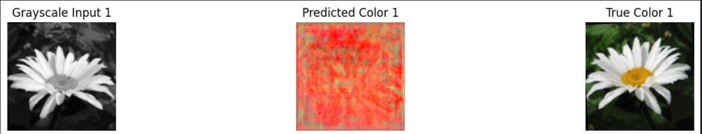
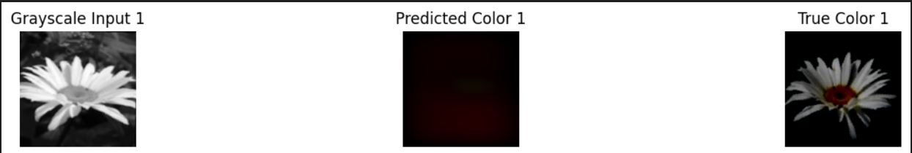
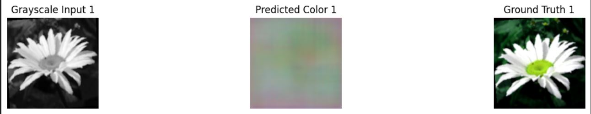
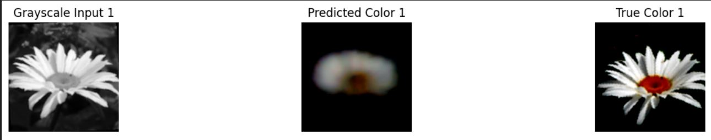
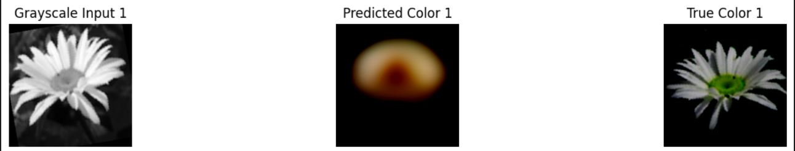
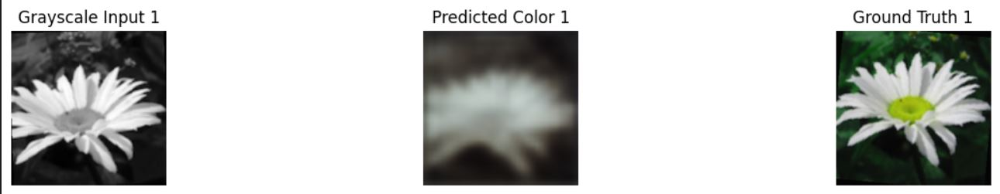

# Colorization of Black and White Images Using ResNet, UNet, and Pix2Pix GAN

## 📌 Overview

Image colorization is a complex and inherently ambiguous problem, where a single grayscale image can have multiple plausible colorized outputs. This project investigates and compares the effectiveness of three deep learning models—**ResNet-based Autoencoder**, **UNet**, and **Pix2Pix GAN**—for the task of colorizing black and white images.

We trained and fine-tuned these models using a custom-built dataset of over 12,000 images and evaluated them using both **quantitative metrics** (PSNR, SSIM, LPIPS, CIEDE2000) and **qualitative visual comparison**.

---

## 📁 Dataset

A custom dataset was created by combining and preprocessing the following publicly available datasets:

- Landscape Image Colorization Dataset
- Color and Grayscale Dataset (cars and flowers)
- Image Colorization Dataset
- Vintage Bangladesh Dataset

**Total Images:** ~12,000  
**Training Images:** 11,400  
**Testing Images:** 2,300

The dataset is hosted on Kaggle: [GenAI Dataset Project](https://www.kaggle.com/datasets/sameertahir/genai-dataset-project)

---

## 🧪 Models & Methodology

### 🔹 Preprocessing Pipeline
- Resizing to 256x256
- Random cropping, flipping, rotation
- Normalization to [-1, 1]
- Grayscale and color images handled in separate directories

### 🔸 Pix2Pix GAN
- Generator: ResNet50-based Fully Convolutional Network
- Discriminator: CNN classifier
- Losses: Adversarial (BCE) + L1
- Epochs: 20

### 🔸 ResNet-based Autoencoder
- Encoder: Pretrained ResNet34
- Decoder: Custom upsampling layers
- Loss: Mean Squared Error (L2)
- Epochs: 30

### 🔸 UNet
- Encoder: Pretrained ResNet34
- Decoder: Symmetric decoder with skip connections
- Loss: Mean Squared Error (L2)
- Epochs: 30

---

## 📊 Evaluation Metrics

| Metric        | Description                                                                 |
|---------------|-----------------------------------------------------------------------------|
| **PSNR**      | Measures pixel-level similarity (higher = better)                          |
| **SSIM**      | Structural similarity (0–1 range; higher = better)                         |
| **LPIPS**     | Perceptual similarity (lower = better)                                     |
| **CIEDE2000** | Color difference in Lab space (lower = better)                             |

---

## 📈 Results

### Pretrained Model Performance

| Model         | PSNR (dB) | LPIPS   | CIEDE2000 / SSIM   |
|---------------|-----------|---------|---------------------|
| UNet          | 0.46      | 0.8895  | 60.6416             |
| ResNet        | 5.63      | 0.9152  | 32.5468             |
| Pix2Pix GAN   | 4.05      | 0.9741  | 0.1213 (SSIM)       |

### Fine-Tuned Model Performance

| Model         | PSNR (dB) | LPIPS   | CIEDE2000 / SSIM   |
|---------------|-----------|---------|---------------------|
| UNet          | 8.31      | 0.8116  | 23.4407             |
| ResNet        | 8.34      | 0.8517  | 23.3363             |
| Pix2Pix GAN   | 6.80      | 0.8926  | 0.1520 (SSIM)       |

---

## 🖼️ Visual Comparisons

### 🔹 Pretrained UNet
Grayscale → Predicted → Ground Truth  

---

### 🔹 Pretrained ResNet
Grayscale → Predicted → Ground Truth  

---

### 🔹 Pretrained Pix2Pix GAN
Grayscale → Predicted → Ground Truth  

---

### 🔸 Fine-tuned UNet
Grayscale → Predicted → Ground Truth  

---

### 🔸 Fine-tuned ResNet
Grayscale → Predicted → Ground Truth  

---

### 🔸 Fine-tuned Pix2Pix GAN
Grayscale → Predicted → Ground Truth  

---

## 🔍 Insights & Conclusion

- **UNet** produced the most perceptually realistic images (lowest LPIPS).
- **ResNet** yielded the highest PSNR and comparable CIEDE2000 scores.
- **Pix2Pix GAN**, while structurally strong, had lower color fidelity.

Fine-tuning significantly improved model performance across the board. Future work may explore **diffusion models** and **VAEs** for even greater realism and color diversity.

---

## ✍️ Authors

- Ammar M. Anwar 
- Sameer Tahir 
- Umar Asghar
  
